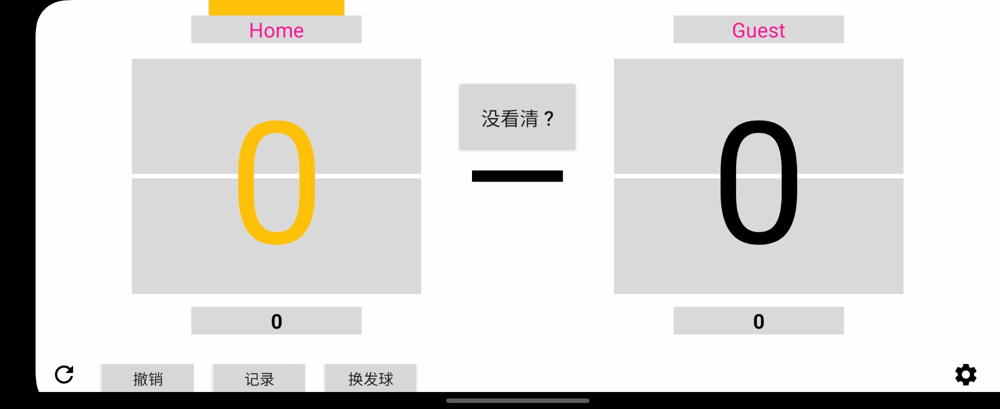
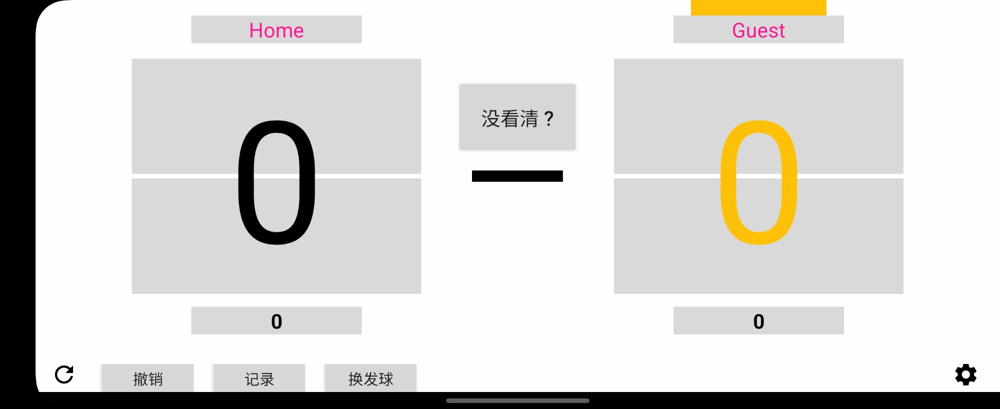
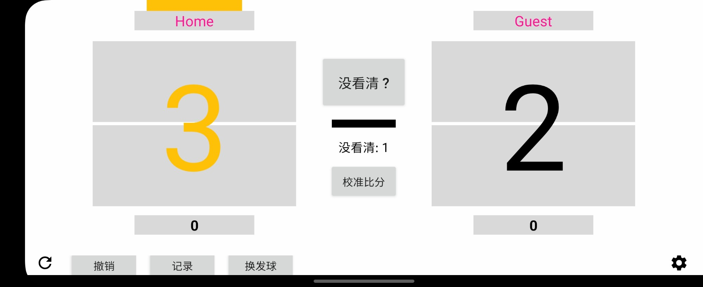
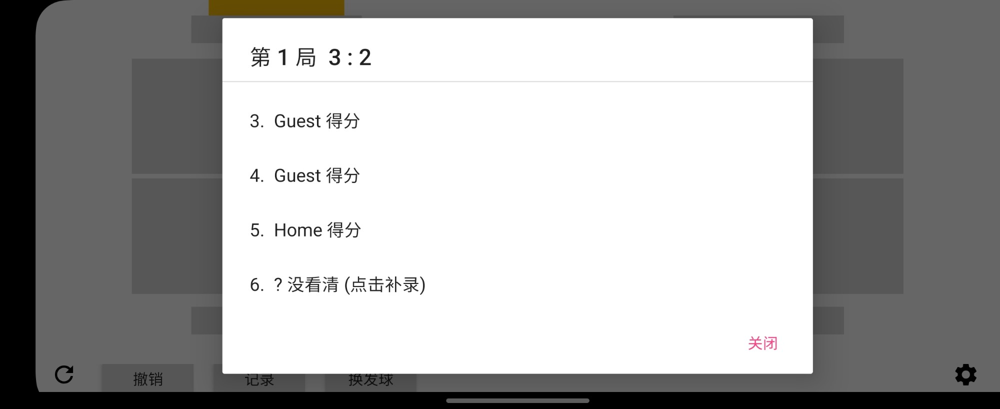
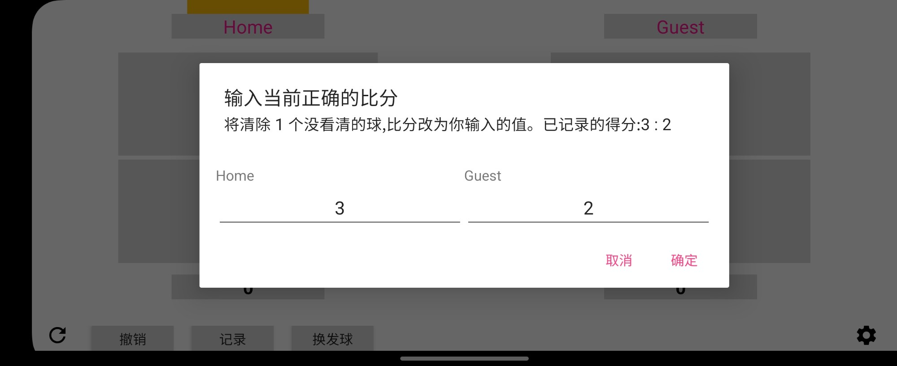

# Score Board

### Simple android app which can record table tennis score data

<h1 align=center>

</h1>

  

## Screenshots

The serving side is highlighted (yellow score and tag). Tap the upper half of a side to give that player a point,
the lower half (or **撤销**) to undo.

| Home serves | Guest serves |
|---|---|
|  |  |

## Didn't see who won a ball?

Press **没看清 ?** in the centre: the ball counts for the serve order but gives nobody a point, and a
"没看清: N" counter appears with a **校准比分** button.

| Unknown ball recorded (3:2, 1 unknown) | **记录**: tap the `?` ball to assign it |
|---|---|
|  |  |

If someone later tells you the real score, **校准比分** clears the unknown balls and sets the score you enter:

Rules: 11 points, win by 2, serve changes every 2 balls and every ball after 10:10. **换发球** switches the server.

## Builds

GitHub Actions builds and tests every push to `master` and every pull request targeting `master` (`.github/workflows/android.yml`); it can also be started manually from the Actions tab.
Download the debug APK from the **Artifacts** section of a run on the Actions tab.
Pushing a tag such as `v1.1.0` also publishes the APK as a GitHub Release.
